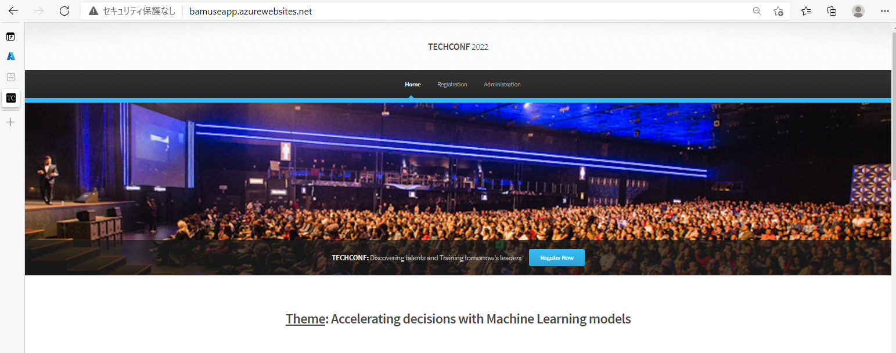
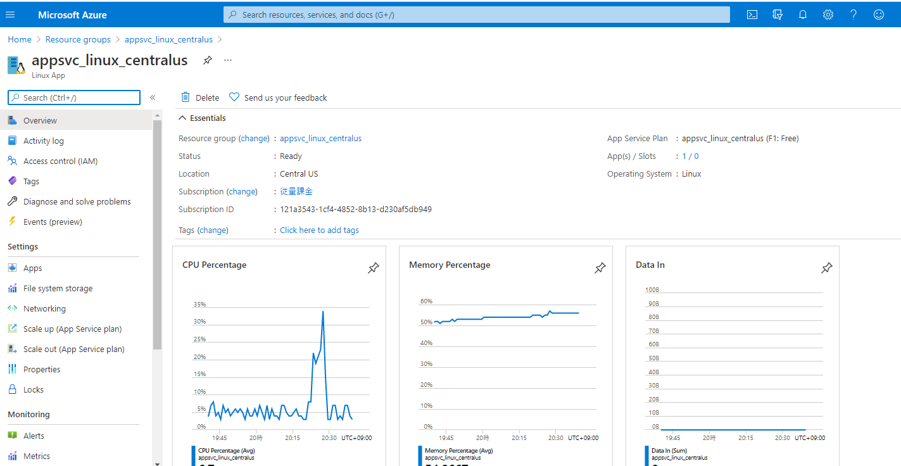
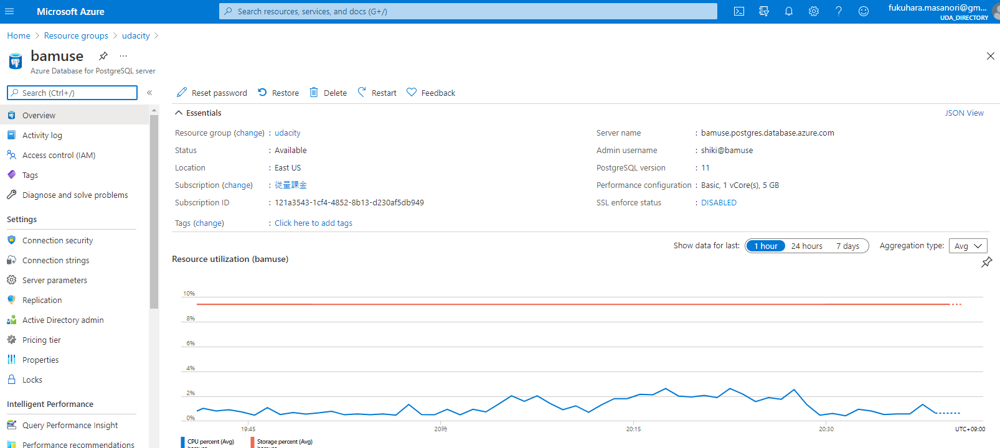
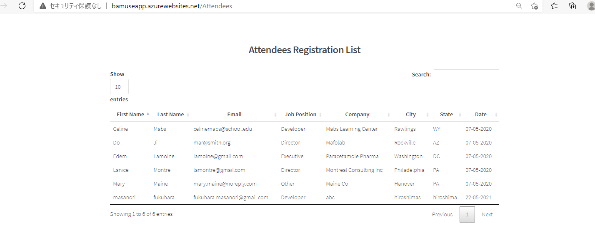
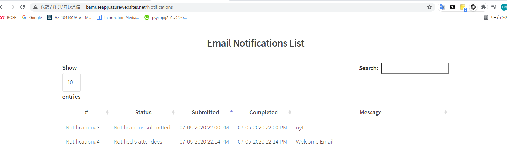
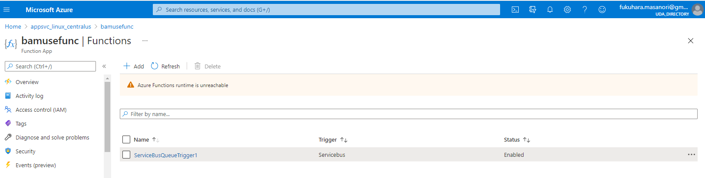
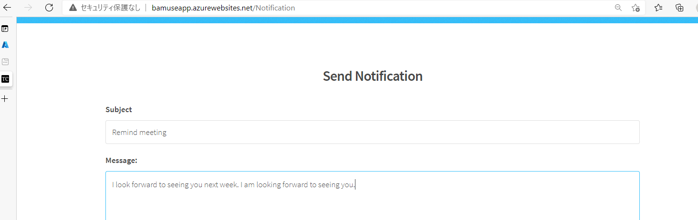
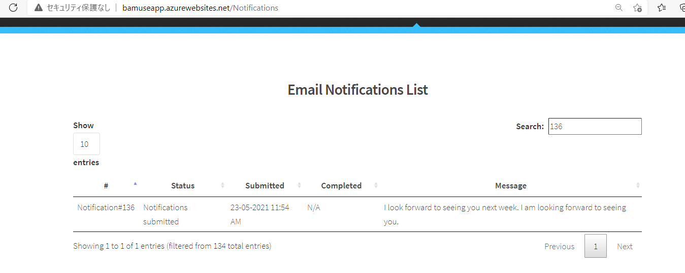
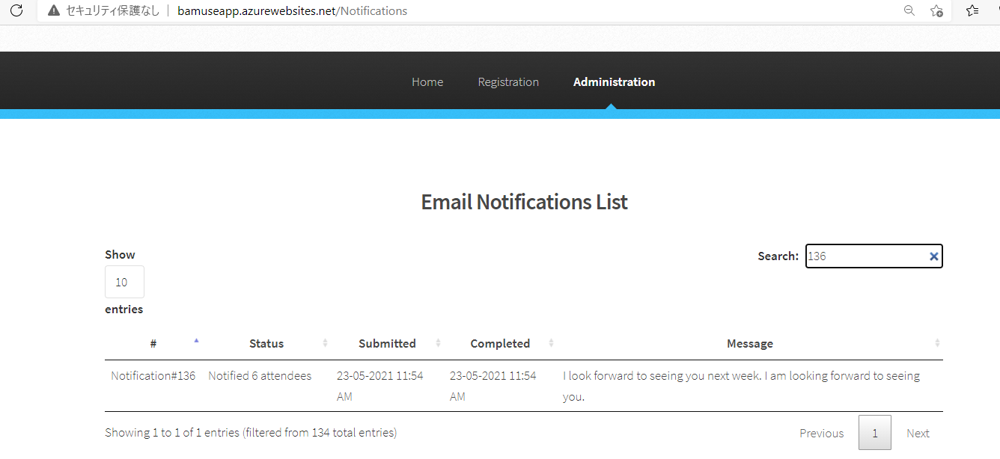

# TechConf Registration Website

## Project Overview
The TechConf website allows attendees to register for an upcoming conference. Administrators can also view the list of attendees and notify all attendees via a personalized email message.

The application is currently working but the following pain points have triggered the need for migration to Azure:
 - The web application is not scalable to handle user load at peak
 - When the admin sends out notifications, it's currently taking a long time because it's looping through all attendees, resulting in some HTTP timeout exceptions
 - The current architecture is not cost-effective 

In this project, you are tasked to do the following:
- Migrate and deploy the pre-existing web app to an Azure App Service
- Migrate a PostgreSQL database backup to an Azure Postgres database instance
- Refactor the notification logic to an Azure Function via a service bus queue message

## Dependencies

You will need to install the following locally:
- [Postgres](https://www.postgresql.org/download/)
- [Visual Studio Code](https://code.visualstudio.com/download)
- [Azure Function tools V3](https://docs.microsoft.com/en-us/azure/azure-functions/functions-run-local?tabs=windows%2Ccsharp%2Cbash#install-the-azure-functions-core-tools)
- [Azure CLI](https://docs.microsoft.com/en-us/cli/azure/install-azure-cli?view=azure-cli-latest)
- [Azure Tools for Visual Studio Code](https://marketplace.visualstudio.com/items?itemName=ms-vscode.vscode-node-azure-pack)

## Project Instructions

### Part 1: Create Azure Resources and Deploy Web App
1. Create a Resource group
2. Create an Azure Postgres Database single server
   - Add a new database `techconfdb`
   - Allow all IPs to connect to database server
   - Restore the database with the backup located in the data folder
3. Create a Service Bus resource with a `notificationqueue` that will be used to communicate between the web and the function
   - Open the web folder and update the following in the `config.py` file
      - `POSTGRES_URL`
      - `POSTGRES_USER`
      - `POSTGRES_PW`
      - `POSTGRES_DB`
      - `SERVICE_BUS_CONNECTION_STRING`
4. Create App Service plan
5. Create a storage account
6. Deploy the web app

### Part 2: Create and Publish Azure Function
1. Create an Azure Function in the `function` folder that is triggered by the service bus queue created in Part 1.

      **Note**: Skeleton code has been provided in the **README** file located in the `function` folder. You will need to copy/paste this code into the `__init.py__` file in the `function` folder.
      - The Azure Function should do the following:
         - Process the message which is the `notification_id`
         - Query the database using `psycopg2` library for the given notification to retrieve the subject and message
         - Query the database to retrieve a list of attendees (**email** and **first name**)
         - Loop through each attendee and send a personalized subject message
         - After the notification, update the notification status with the total number of attendees notified
2. Publish the Azure Function

### Part 3: Refactor `routes.py`
1. Refactor the post logic in `web/app/routes.py -> notification()` using servicebus `queue_client`:
   - The notification method on POST should save the notification object and queue the notification id for the function to pick it up
2. Re-deploy the web app to publish changes

## Monthly Cost Analysis

| Azure Resource | Service Tier | Monthly Cost |
| ------------ | ------------ | ------------ |
| *Azure Postgres Database* |Basic|     $70        |
| *Azure Service Bus*        |Basic|     $5         |
| *Azure Finction*      |consumption|     $0  |
| *Azure App Service*  |Basic|$13|
| *Total* |     |   $88

## Architecture Explanation
This site is a registration site for conferences, and it is not always accessed, and access is concentrated before and after the conference, so the scale according to the load is an important factor.
Therefore, the operation of the instance that is always started is not appropriate in terms of cost, and WebApp that is quick and has an advantage in operation cost due to flexible autoscale support and management is adopted.

In addition, in order to stably deliver emails from several people to tens of thousands of participants, it is difficult to predict the processing time required for email delivery processing and registration of delivery results in the database, so an asynchronous processing service bus is adopted. You can build a system that is strong in scale by hooking with a message and executing mail delivery and registration of the delivery result database with Azure function.

## Screenshots

